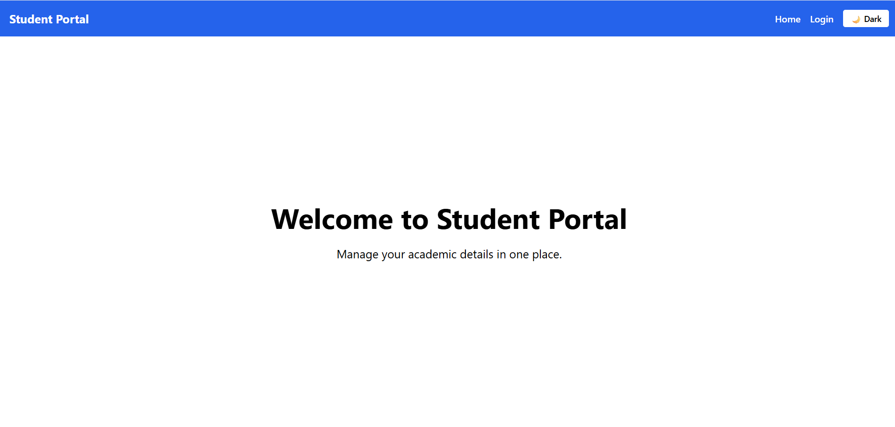

# Student Portal

## Project Overview
Student Portal is a React-based web application that allows users to log in, view their dashboard with user-specific data, and log out. It features a sticky navbar and responsive design, providing a smooth user experience.

## Features
- User Login and Logout functionality
- Sticky Navbar for easy navigation
- Dashboard displaying user data fetched from an API
- Responsive design for desktop and mobile
- Tailwind CSS styling via CDN

## Live Demo
Check out the live application deployed on Vercel:  
[https://student-portal-omega-jet.vercel.app](https://student-portal-omega-jet.vercel.app)

## Screenshots

### Home Page  
**Lightmode:**

**Darkmode:**


### Login Page  
**Lightmode:**

**Darkmode:**


### Dashboard  


## Getting Started

### Prerequisites
- Node.js and npm installed on your machine

### Installation and Running Locally

1. Clone the repository:
    ```bash
    git clone https://github.com/AnchalGupta1117/student-portal.git
    cd student-portal
    ```

2. Install dependencies:
    ```bash
    npm install
    ```

3. Run the development server:
    ```bash
    npm run dev
    ```

4. Open [http://localhost:5173](http://localhost:5173) in your browser to see the app.

## Deployment
This project is deployed on Vercel. On each push to the `main` branch, Vercel automatically rebuilds and redeploys the app.

## Technologies Used
- React
- React Router DOM
- Vite
- Tailwind CSS (via CDN)
- Vercel (for hosting)

## Author
Anchal Gupta

---

Feel free to reach out if you have any questions or feedback!
